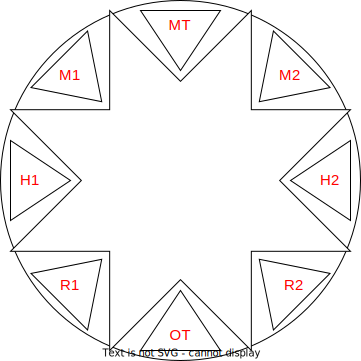
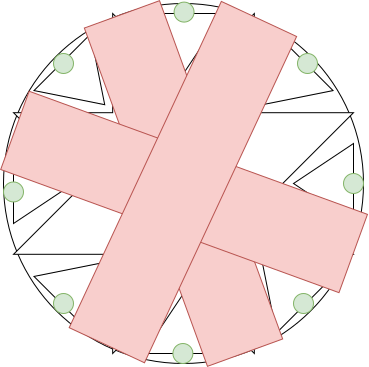
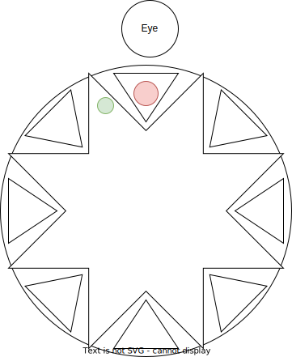
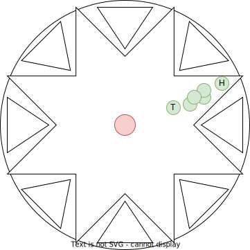
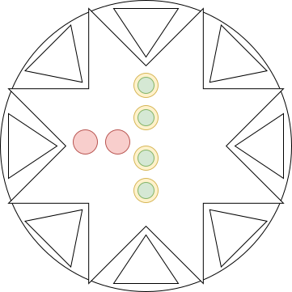

## Preparation
Set the 8 waymarks on the area as follows:  
  

  
- MT/OT = Main / Offtank
- M1/M2 = Melee DPS
- R1/R2 = Ranged DPS
- H1/H2 = Healers

## Phase  1: Thordan

- **Tank** pulls Thordan towards the 12:00 position, facing away from the party.
- The **rest** stacks together behind him and dodges the first AoE that spawn on each players.
- Turn away from Thordan as soon as the eye marker appears on him.
- Spread apart when purple markers appear above your heads.
- Stack behind Thordan again for the stack marker
- **Healers** heal up the following raidwide damage
- **Healers** shield and heal the **Main Tank** against the tank buster

> Don't touch the edge of the arena from now on, it will kill you

## Phase  2: Conviction Towers

- Stack in the center, wait until the circles appear, then move to the assigned positions
  - This should also break the chains
- Place a player in each of the 4 conviction towers, otherwise the entire raid will be paralyzed

## Phase  3: Sacred Cross / Spiral Thrust

- Kill the add ASAP
  - The damage the raid receives is based on the leftover health of the add
- Place yourself at the edge of the arena as marked by the green dots here to avoid damage

## Phase  4: Two Knights

- **Tank** the two knights separate from each other
- When the knights cast *Divine Right*, focus the one who gets the *Sword Oath* buff
- On *Holy Bladedance* **Healers** shield and heal, *Sword Oath* **Tanks** pop heavy CDs
  - After that three **DPS** get marked with a blue marker, first marked runs north, second south, third north again
  - The damage from this attack is proximity based
  - Knights will switch stances
- *Holiest of Holy* is a raidwide, which is immediatly followed by a *Holy Bladedance*; **Healers** need to sweat here 
- Repeat until both knights are dead

## Phase  5: Dimensional Collapse / Spiral Pierce / Hiemal Storm

- Gather the party in the center
- Black-red circles appear -> move to your designated locations
- Three people with tethers will be targeted by a *Spriral Thrust*, STAY AWAY
- The rest will be marked for frozen circles, place them at the edge
- Move to the center, position yourself that the knockback won't knock you into the frozen circles

## Phase  6: Meteors / Heavy Impact

- Kill all appearing *Comet* and *Meteror Circle*s
  - You may ignore ONE *Comet Circle*
- Marked players move away from the players to avoid AoE damage
- Dodge the cocentric circles that appear, they appear in 3 timed layers so only minimal movement is needed

## Phase  7: Ultimate End

- Stack in the center and move against the small knockbacks
- **Healers** apply a shield afterwards to mitigate the incoming damage

> Each player that died between Phase 1 and 7 will increase the damage done

## Phase  8: Spear of Fury

- Tank Thordan north, **Tank** positioned at 11 o'clock
- A *Dragon Eye* will spawn outside the arena at 12 o'clock
  - Avoid looking at both of them during *Dragon's Gaze*
  - First eye always spawns at 12 o'clock, afterwards at random locations; **Tank** adjusts

- One of the **Healers** will be marked green; move to the edge of the arena
- **Off Tank** moves between add and **Healer**; Everyone else moves between **Off Tank** and **Healer**

- During that attack **Main Tank** will get hit by a tank buster; Remaining **Healer** needs to heal
- Turn around to dodge *Dragon's Gaze*
- Heal up against the raidwide damage

## Phase  9: Conviction Towers / Dragon's Gaze / Heavy Impact

- **Tank** moves Thordan to the new eye position
- Place players in each *Conviction Tower* as shows in the image below
  - They will always spawn in that shape but turned randomly
  - Dodge *Heavy Impact*, but stay in the towers as it's only always affecting half of the tower area

- After the first ring explodes *Dragon's Gaze* will happen; turn away
- Stack in the middle for *Heavy Impact*
- Knockback / Stack Marker combo will happen, try to get pushed into just one direction
- **Main Tank** moves away immediatly to prevent cleave attacks into the party

## Phase 10: Lightning Storm / Skyward Leap / Spiral Thrust / Dragon's Rage

- Spread to reduce the damage taken from *Lightning Storm* (purple markers)
- One player will get a blue mark; move away from the party
- One player will get a tether to a knight; move so the charge doesn't hit others
- One knight will charge in a line from the edge of the arena as in phase 3
- After *Dragon's Rage* hits, **Healers** heal the **Main Tank** for the tank buster

## Phase 11: Holy Chains / Dragon's Gaze / Ascalon's Fury / Hiemal Storm / Heavensflame

> The image from the preparation section is needed here, just rotated according to the **Main Tank**s current position

- **Main Tank** moves Thordan to the new eye location
- Break chains by moving to the designated positions (remember the assigned spaces are rotated now)
- Some players will get marked for meteors
- At the same time holy flames will spawn
- DURING all that stay turned away from Thordan to dodge the *Dragon's Gaze*
- Immediatly afterwards move into the free spaces of *Ascalon's Fury* (the fan-like AoE)
  - And keep away from other players with Hiemal Storm (blue marker)
- Stack behind Thordan and keep **Heal**ing

## Phase 12: Sacred Cross / Dragon's Gaze

- **Main Tank** moves Thordan to the new eye location
- Thordan will become immune to damage, so target the add
  - A **Melee DPS** LB3 might be necessary
- **Healers** keep everyone topped up at all times
- After *Sacred Cross* is finished he will use a tank buster and multiple cleaves
- He then slowly casts *Ancient Quagga*, failing to defeat him before the cast is done will end in a wipe